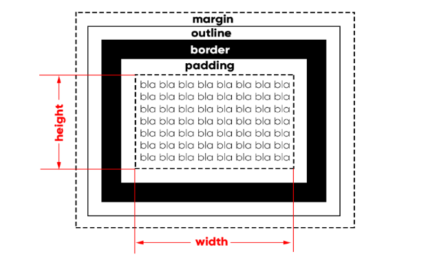
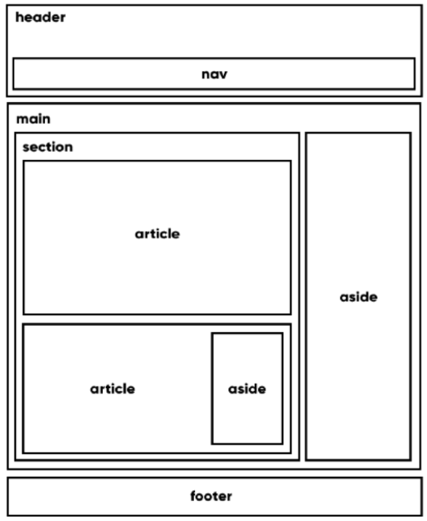

# O que é uma caixa?
- Os elementos HTML de nosso site são tratados como caixas (na grande maioria das vezes).
- Podem ser caixas que armazenam conteúdo ou caixas que armazenam outras caixas.

## Anatomia de uma caixa 

- A parte que contém o texto é chamada de conteúdo (*content*).
- Por padrão às caixas vem só com o conteúdo, mas sem *margin*, *outline*, *border* e *padding*. Com exceção do *body*, que vem com uma *margin* de *8px*.
- Todo conteúdo possui uma **largura** (*width*) e uma **altura** (*height*).
- A borda é a linha que fica em volta do conteúdo.
- O *padding* é o preenchimento do elemento. Distância entre a borda e o conteúdo.
- O espaço externo é a margem (*margin*).
- O tracejado que fica dentro da margem se chama *outline*.

## Margens no automático 
- `margin: auto;`
- O navegador calculará automaticamente a margem da esquerda e da direita e deixará o elemento centralizado no meio.

## Tipos de Caixa

### Caixa do tipo box-level
- Sempre vai iniciar com uma nova linha e vai ocupar a largura total.

### Caixa do tipo inline-level
- Começa do ponto exato em que foi definida. Sua largura é relativa ao conteúdo.

## Grouping Tags e Semantic Tags
### Header 
- Cria áreas relativas ao cabeçalho. Também pode conter o menu de navegação.

### Nav
- Área em que possui os links de navegação. Pode estar dentro de um *<header>*.

### Main
- Onde o conteúdo prinipal do nosso site vai se encontrar.

### Section
- Contém o conteúdo em seu corpo ou divi eles em artigos.

### Article
- Guarda o conteúdo que pode ser lido de forma independente.

### Aside
- Conteúdo periférico e complementar.

### Footer
- Rodapé do site. 

### Exemplo de um estrutura de site
